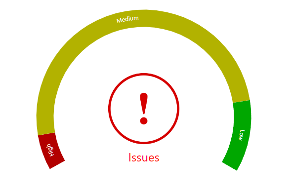

# react-cropped-doughnut-chart

> A cropped doughnutchart, with customizable image and text on center


[](https://www.npmjs.com/package/react-cropped-doughnut-chart) [](https://standardjs.com)


## Demo
[https://muthuishere.github.io/react-cropped-doughnut-chart/](https://muthuishere.github.io/react-cropped-doughnut-chart/)




## Install

```bash
npm install --save react-cropped-doughnut-chart
```


## Usage

```jsx
import React from 'react'

import { HorseShoeChart } from 'react-cropped-doughnut-chart'
import 'react-cropped-doughnut-chart/dist/index.css'


const App = () => {


  const defaultItems =[
    { value:24,color:"red",labelColor:"white",label:"High"},
    { value:227,color:"yellow",labelColor:"white",label:"Medium"},
    { value:49,color:"#00EE00",label:"Low"},
  ]

  const defaultOptions = {
    radius: 200,
    title:"Issues",
    titleColor:"#FF0000",
    thicknessSize:"S",
    gapSize:"XL",
    labelSize:12,
    showAnimation: false,
    animationDurationInSeconds:5,
    labelColor:"white",
    backgroundColor:"white",
    imageUrl:"https://upload.wikimedia.org/wikipedia/commons/thumb/8/8a/Noun_project_exclamation_icon_620383.svg/512px-Noun_project_exclamation_icon_620383.svg.png?20180327224854"
  }


  return <div className="container">
    <HorseShoeChart items={defaultItems} options={defaultOptions} />
  </div>
}


```

## License

MIT © [muthuishere](https://github.com/muthuishere)
